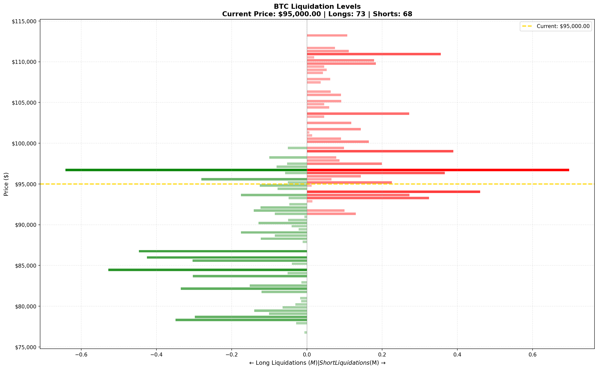

# Hyperliquid Liquidation Levels Heatmap

A comprehensive Python tool for analyzing and visualizing liquidation levels on [Hyperliquid](https://hyperliquid.xyz), a decentralized perpetual exchange. This tool fetches position data, scrapes whale activity, calculates liquidation prices, and generates visual heatmaps to help traders understand where major liquidations are clustered.


## 📊 Liquidation Levels Visualization

<p align="center">
  
</p>

<p align="center">
  <em>Example: BTC liquidation levels heatmap showing where long (green) and short (red) positions would be liquidated</em>
</p>

```
                ← Long Liquidations              Short Liquidations →
                                  │
    $99,000   ─────────────      │      ██████████████████  ← Short cluster
    $98,000   ──────             │      ████████████████
    $97,000   ────               │      ██████████████
    $96,500   ──                 │      ████████
              ─────────────────────────────────────────────
    $95,000                  Current Price ($95,000)
              ─────────────────────────────────────────────
    $93,500   ████               │
    $93,000   ████████████       │
    $92,000   ████████████████   │        ← Long cluster
    $91,000   ██████████████████ │
    $90,000   ██████████         │
                                 │
```

The heatmap shows liquidation clusters similar to how order book depth is displayed on the Hyperliquid trading interface. **Green bars** indicate where long positions will be liquidated if price drops, while **red bars** show where short positions will be liquidated if price rises. Larger bars = more value at risk at that price level.

## Table of Contents

- [Features](#features)
- [How It Works](#how-it-works)
- [Installation](#installation)
- [Quick Start](#quick-start)
- [Usage](#usage)
  - [Basic Usage](#basic-usage)
  - [Demo Mode](#demo-mode)
  - [Interactive Charts](#interactive-charts)
  - [Continuous Monitoring](#continuous-monitoring)
  - [Custom Assets](#custom-assets)
- [Understanding the Heatmap](#understanding-the-heatmap)
- [Architecture](#architecture)
- [API Reference](#api-reference)
- [Configuration](#configuration)
- [Data Sources](#data-sources)
- [Liquidation Formula](#liquidation-formula)
- [Examples](#examples)
- [Troubleshooting](#troubleshooting)
- [Contributing](#contributing)
- [Disclaimer](#disclaimer)
- [License](#license)

## Features

- **Real-time Data**: Fetches live position data from Hyperliquid's public API
- **Whale Tracking**: Scrapes whale trades and positions from Hypurrscan.io
- **Multi-Asset Support**: Tracks BTC, ETH, HYPE and other perpetual markets
- **Liquidation Calculation**: Accurate liquidation price computation based on leverage and margin type
- **Visual Heatmaps**:
  - Static PNG heatmaps (matplotlib)
  - Interactive HTML dashboards (plotly)
- **Cluster Detection**: Identifies major liquidation clusters and key price levels
- **Terminal Output**: Rich console output with summary statistics
- **Continuous Mode**: Run as a service with periodic updates
- **Demo Mode**: Test with sample data without API calls

## How It Works

### Liquidation Basics

On Hyperliquid, traders can open leveraged positions (long or short). When a position moves against the trader significantly, they risk **liquidation** - where the exchange forcefully closes their position to prevent negative equity.

**Long positions** are liquidated when the price **falls** below their liquidation price.
**Short positions** are liquidated when the price **rises** above their liquidation price.

### What This Tool Does

1. **Collects Position Data**: Fetches positions from whale wallets and Hypurrscan
2. **Calculates Liquidation Prices**: Computes where each position would be liquidated
3. **Aggregates by Price Level**: Groups liquidations into price bins
4. **Visualizes as Heatmap**: Shows concentration of liquidation value at each price level

### Why This Matters

Large clusters of liquidations can cause **cascading effects**:
- When price hits a liquidation cluster, positions are forcefully closed
- These forced closures add selling/buying pressure
- This can push price through more liquidation levels
- Creating a "liquidation cascade" or "squeeze"

Understanding where these clusters are helps traders:
- Identify potential support/resistance levels
- Anticipate volatility zones
- Manage risk more effectively

## Installation

### Prerequisites

- Python 3.9 or higher
- pip (Python package manager)

### Setup

1. **Clone the repository**
```bash
git clone https://github.com/yourusername/Hyperliquid-Liquidation-Levels.git
cd Hyperliquid-Liquidation-Levels
```

2. **Create a virtual environment** (recommended)
```bash
python -m venv venv
source venv/bin/activate  # On Windows: venv\Scripts\activate
```

3. **Install dependencies**
```bash
pip install -r requirements.txt
```

### Dependencies

| Package | Purpose |
|---------|---------|
| `requests` | HTTP requests to Hyperliquid API |
| `aiohttp` | Async HTTP for concurrent fetching |
| `beautifulsoup4` | Web scraping Hypurrscan |
| `pandas` | Data manipulation |
| `numpy` | Numerical computations |
| `matplotlib` | Static chart generation |
| `seaborn` | Enhanced visualizations |
| `plotly` | Interactive HTML charts |
| `rich` | Terminal formatting |
| `python-dotenv` | Environment configuration |

## Quick Start

```bash
# Run in demo mode (no API calls, uses sample data)
python main.py --demo

# Run with real data
python main.py

# Generate interactive HTML charts
python main.py --interactive

# Track specific assets
python main.py --assets BTC ETH
```

## Usage

### Basic Usage

```bash
python main.py
```

This will:
1. Fetch current prices from Hyperliquid
2. Collect whale addresses from various sources
3. Query positions for those addresses
4. Calculate liquidation levels
5. Generate heatmaps in the `output/` directory

### Demo Mode

Test the tool without making API calls:

```bash
python main.py --demo
```

This generates realistic sample positions to demonstrate the visualization capabilities.

### Interactive Charts

Generate interactive HTML charts with hover details:

```bash
python main.py --interactive
# or
python main.py -i
```

Open the generated `.html` files in your browser for an interactive experience.

### Continuous Monitoring

Run continuously with periodic updates:

```bash
# Update every 5 minutes (default)
python main.py --continuous

# Update every minute
python main.py --continuous --interval 60

# With interactive charts
python main.py -c -i --interval 120
```

Press `Ctrl+C` to stop.

### Custom Assets

Track specific assets:

```bash
# Only BTC and ETH
python main.py --assets BTC ETH

# Add other Hyperliquid perpetuals
python main.py --assets BTC ETH SOL DOGE
```

### All Options

```bash
python main.py --help

Options:
  --demo              Run with sample data (no API calls)
  --assets ASSETS     Assets to track (default: BTC ETH HYPE)
  --interactive, -i   Generate interactive HTML charts
  --continuous, -c    Run continuously with updates
  --interval SECONDS  Update interval for continuous mode (default: 300)
  --output DIR        Output directory (default: output)
  --max-whales NUM    Max whale addresses to query (default: 50)
  --testnet           Use Hyperliquid testnet
```

## Understanding the Heatmap

### Reading the Chart

```
                    ← Long Liquidations | Short Liquidations →

$100,000  ─────────────────────────────────────────────────────
          |                              ████████  <- Short cluster
$98,000   |                         ██████████████
          |                    █████████████████████
$96,000   ─────── Current Price ─────────────────────────────
          |        █████████████
$94,000   |   █████████████████      <- Long cluster
          |  ████████████████████
$92,000   ─────────────────────────────────────────────────────
```

### Color Interpretation

- **Green bars** (left side): Long liquidations - triggered when price **falls**
- **Red bars** (right side): Short liquidations - triggered when price **rises**
- **Bar length**: Proportional to USD value at risk
- **Bar intensity**: Darker = more concentrated liquidations
- **Gold dashed line**: Current market price

### Key Metrics

| Metric | Description |
|--------|-------------|
| Total Long Value | Sum of all long position values that could be liquidated |
| Total Short Value | Sum of all short position values that could be liquidated |
| L/S Ratio | Long value / Short value (>1 = more longs at risk) |
| Major Levels | Price points with highest liquidation concentration |

## Architecture

```
┌─────────────────────────────────────────────────────────────┐
│                        main.py                               │
│                  (Entry point & CLI)                         │
└─────────────────────┬───────────────────────────────────────┘
                      │
          ┌───────────┴───────────┐
          ▼                       ▼
┌─────────────────┐     ┌─────────────────┐
│ hyperliquid_api │     │    scraper      │
│ (API client)    │     │ (Hypurrscan)    │
└────────┬────────┘     └────────┬────────┘
         │                       │
         └───────────┬───────────┘
                     ▼
         ┌───────────────────────┐
         │ liquidation_calculator│
         │ (Core calculations)   │
         └───────────┬───────────┘
                     ▼
         ┌───────────────────────┐
         │  heatmap_visualizer   │
         │ (Charts & output)     │
         └───────────────────────┘
```

### Module Overview

| Module | Description |
|--------|-------------|
| `main.py` | Entry point, CLI parsing, orchestration |
| `config.py` | Configuration constants and settings |
| `hyperliquid_api.py` | Hyperliquid API client, position fetching |
| `scraper.py` | Web scraping for Hypurrscan whale data |
| `liquidation_calculator.py` | Liquidation price calculations, data aggregation |
| `heatmap_visualizer.py` | Matplotlib and Plotly visualizations |

## API Reference

### HyperliquidAPI

```python
from hyperliquid_api import HyperliquidAPI

# Initialize client
api = HyperliquidAPI(use_testnet=False)

# Get all mid prices
prices = api.get_all_mids()
# {'BTC': 95000.0, 'ETH': 3500.0, ...}

# Get user positions
positions = api.get_user_positions("0x...")
# [Position(coin='BTC', size=1.5, leverage=10, ...), ...]

# Get market metadata
assets, market_data = api.get_meta_and_asset_contexts()
```

### LiquidationCalculator

```python
from liquidation_calculator import LiquidationCalculator

calc = LiquidationCalculator()

# Calculate liquidation price
liq_price = calc.calculate_position_liquidation(
    entry_price=95000,
    size=1.0,  # Positive for long
    leverage=10,
    margin_type="isolated",
    coin="BTC"
)

# Aggregate positions into heatmap data
heatmap_data = calc.aggregate_positions(
    positions=positions,
    coin="BTC",
    current_price=95000
)

# Find liquidation clusters
clusters = calc.find_liquidation_clusters(heatmap_data)
```

### HeatmapVisualizer

```python
from heatmap_visualizer import HeatmapVisualizer

viz = HeatmapVisualizer()

# Create static heatmap
viz.create_combined_heatmap(heatmap_data, save=True, show=True)

# Create interactive chart
viz.create_interactive_heatmap(heatmap_data, save=True)

# Create multi-asset dashboard
viz.create_dashboard([btc_data, eth_data, hype_data])
```

## Configuration

### Environment Variables

Create a `.env` file:

```bash
# API Settings
HYPERLIQUID_API_URL=https://api.hyperliquid.xyz/info
USE_TESTNET=false

# Output Settings
OUTPUT_DIR=output

# Cache Settings
CACHE_TTL=60
```

### Configuration File

Edit `config.py` for advanced settings:

```python
# Minimum position size to consider
min_position_usd = 10000.0

# Whale threshold
whale_threshold_usd = 100000.0

# Number of price levels in heatmap
price_levels = 100

# Price range (% around current price)
price_range_percent = 20.0
```

## Data Sources

### Hyperliquid API

The official Hyperliquid API provides:
- Real-time prices (`allMids`)
- User positions (`clearinghouseState`)
- Market metadata (`metaAndAssetCtxs`)

**Endpoint**: `https://api.hyperliquid.xyz/info`

**Rate Limits**: ~5 requests/second recommended

### Hypurrscan.io

Hypurrscan is a third-party explorer for Hyperliquid that provides:
- Whale leaderboards
- Large trade history
- Position tracking

**Note**: Web scraping may be subject to rate limits and terms of service.

### Alternative Sources

For enterprise use, consider:
- [CoinGlass API](https://www.coinglass.com/hyperliquid) - Paid whale data
- [Nansen API](https://docs.nansen.ai/api/hyperliquid-apis) - On-chain analytics

## Liquidation Formula

Hyperliquid uses the following formula for liquidation prices:

```
liq_price = entry_price - side × margin_available / position_size / (1 - L × side)
```

Where:
- `side` = +1 for long, -1 for short
- `L` = 1 / maintenance_leverage
- `maintenance_leverage` = 2 × max_leverage

### Simplified Calculations

**For Isolated Margin:**
```
Long:  liq_price ≈ entry × (1 - 1/leverage + maintenance_rate)
Short: liq_price ≈ entry × (1 + 1/leverage - maintenance_rate)
```

**Maintenance Rates by Max Leverage:**
| Max Leverage | Maintenance Rate |
|--------------|------------------|
| 50x | 1.0% |
| 40x | 1.25% |
| 20x | 2.5% |
| 10x | 5.0% |
| 3x | 16.7% |

## Examples

### Example 1: Quick Analysis

```python
from main import LiquidationHeatmapGenerator

gen = LiquidationHeatmapGenerator(assets=['BTC'])
files = gen.run(demo=True)
print(f"Generated: {files}")
```

### Example 2: Custom Visualization

```python
from liquidation_calculator import create_sample_positions, LiquidationCalculator
from heatmap_visualizer import HeatmapVisualizer

# Generate sample data
positions = create_sample_positions("BTC", 95000, count=500)

# Calculate heatmap data
calc = LiquidationCalculator()
data = calc.aggregate_positions(positions, "BTC", 95000)

# Visualize
viz = HeatmapVisualizer()
viz.create_combined_heatmap(data, show=True)
```

### Example 3: Fetch Real Data

```python
from hyperliquid_api import HyperliquidAPI

api = HyperliquidAPI()

# Get prices
prices = api.get_all_mids()
print(f"BTC: ${prices['BTC']:,.2f}")

# Get positions for an address
positions = api.get_user_positions("0x...")
for pos in positions:
    print(f"{pos.coin}: {pos.size} @ ${pos.entry_price:,.2f}")
    print(f"  Liquidation: ${pos.liquidation_price:,.2f}")
```

### Example 4: WebSocket Real-time Updates

```python
import asyncio
from hyperliquid_api import HyperliquidWebSocket

async def on_trade(data):
    print(f"Trade: {data}")

async def main():
    ws = HyperliquidWebSocket()
    await ws.subscribe_trades("BTC", on_trade)
    await ws.listen()

asyncio.run(main())
```

## Output Files

The tool generates the following files in the `output/` directory:

| File Pattern | Description |
|--------------|-------------|
| `{COIN}_combined_heatmap_{timestamp}.png` | Main heatmap visualization |
| `{COIN}_interactive_heatmap_{timestamp}.html` | Interactive Plotly chart |
| `{COIN}_liquidation_stats_{timestamp}.json` | Summary statistics |
| `liquidation_dashboard_{timestamp}.html` | Multi-asset dashboard |

## Troubleshooting

### "No positions found"

- Check network connectivity to Hyperliquid API
- Verify whale addresses are correct (42-character hex)
- Try running with `--demo` to test visualization

### "Rate limited"

- Reduce `--max-whales` parameter
- Increase delay between requests in config
- Consider using cached data

### "Import errors"

```bash
pip install --upgrade -r requirements.txt
```

### "Plotly not available"

```bash
pip install plotly kaleido
```

### "Selenium errors" (for JS-rendered scraping)

```bash
pip install selenium webdriver-manager
```

## Contributing

Contributions are welcome! Please:

1. Fork the repository
2. Create a feature branch (`git checkout -b feature/amazing`)
3. Commit changes (`git commit -m 'Add amazing feature'`)
4. Push to branch (`git push origin feature/amazing`)
5. Open a Pull Request

### Development Setup

```bash
git clone https://github.com/yourusername/Hyperliquid-Liquidation-Levels.git
cd Hyperliquid-Liquidation-Levels
python -m venv venv
source venv/bin/activate
pip install -r requirements.txt
pip install -e .  # Development install
```

## Disclaimer

**This tool is for educational and informational purposes only.**

- Not financial advice
- No guarantees of accuracy
- Use at your own risk
- Respect API rate limits and terms of service
- Past liquidation patterns do not predict future movements

The authors are not responsible for any financial losses incurred from using this tool or acting on its output.

## License

MIT License - see [LICENSE](LICENSE) for details.

## Acknowledgments

- [Hyperliquid](https://hyperliquid.xyz) - Decentralized perpetual exchange
- [Hypurrscan](https://hypurrscan.io) - Hyperliquid explorer
- [CoinGlass](https://coinglass.com) - Crypto derivatives data

---

**Star this repository if you find it useful!**

For questions or support, please [open an issue](https://github.com/yourusername/Hyperliquid-Liquidation-Levels/issues).
